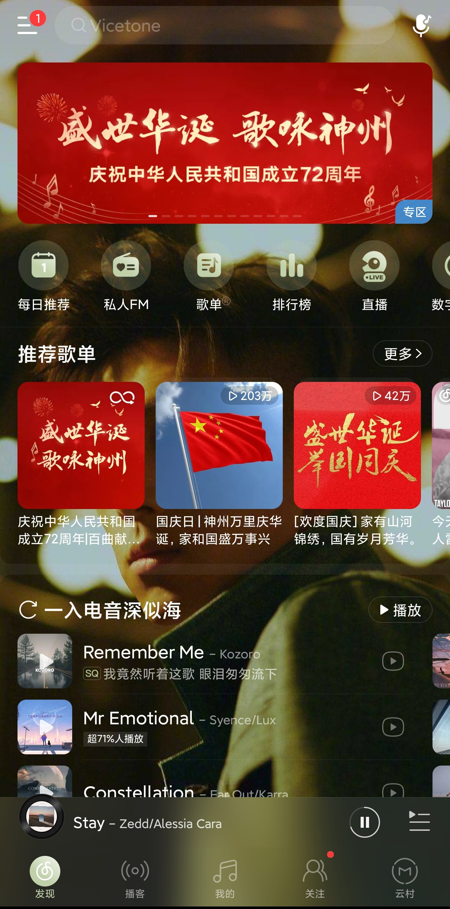

<!DOCTYPE html>
<html lang="zh-cn">
<head>
  <meta charset="UTF-8">
    <title>我的第一个网页</title>
    <link rel="stylesheet" type="text/css" href="styles/2.css">
  </head>
  <body> 
    <h1>冲浪日常</h1>
        
又是平平无奇的一天呢~~

        <h2>起床后的第一首歌</h2> 
        
早上被音乐闹钟吵醒，虽然是喜欢的歌，但还是有点不爽。。。。。洗漱完，打开网易云，点开每日推荐，戴上耳机，假期的第一天开始了。什么？！歌单里又有歌要收费了！！！！ 
           本人听歌风格比较随性，更喜欢电音和古风，偏向于欧美侧（没有说华语乐坛不好的意思),不喜欢大部分韩语歌曲和男团，喜欢华语说唱。比较喜欢的音乐人： 
      

      <table>
        <tr>
          <td id="table1">烟鬼，六公主，sia,ILLENIUM,NEVVE,卡妹，v神，owl city</td>
        </tr>
        <tr>
          <td id="table2">刘瑞琪，李易峰，刘柏辛Lexie,Bo peep,林俊杰</td>
        </tr>
      </table>
    

        
        
    
        
         <a href="file:///D:/Sublime%20Text/Taylor%20Swift%20-%20Cruel%20Summer.mp3">Taylor Swift - Cruel Summer</a>
        <h2>小说追更</h2>
        
求求作者大大更多点，每天两章不够看啊！（另外，这几天的内容有点水啊，啥时候爆发一下。。。。。）

        <a href="https://www.zhhtxt.com/0_946/">轮回乐园-那一只蚊子</a>      
        <a href="https://dushu.baidu.com/pc/detail?gid=4308336905">盖世-逆苍天</a>
    

         
         
    

         <h3>书单</h3>
          <ul>
            <li>轮回乐园</li>
            <li>盖世</li>
            <li>仙逆</li>
            <li>求魔</li>
            <li>灵域</li>
            <li>完美世界</li>
          </ul>
        <h2>微博和超话</h2>
        
虽然本人不是饭圈人，但是有喜欢的明星，超话签到是为数不多的追星之举。当然微博里还有很多有意思的内容，看看热搜，偶尔吃瓜，真是“岁月静好”————
          除了某些时候碰到杠精，希望大家文明冲浪，dddd。
        <a href="https://weibo.com/mygroups?gid=110057487580824">微博超话</a>
        <h2>小破站大快乐</h2>
        
一名常年混迹于沙雕区，美食区，时尚区和二次元的B站小用户，目前在Lv3苦苦挣扎，总是点赞，有时投币，偶尔收藏，上次看到让我一键三连的视频还是在上次。
     

      <a href="https://www.bilibili.com/video/BV1o64y167qq">再来亿遍</a>
    

    

      <a href="https://www.bilibili.com/video/BV13K4y1S75r?spm_id_from=333.999.0.0">真的这么丝滑吗!</a>
    

    

      <a href="https://www.bilibili.com/video/BV1q44y1k7xv?spm_id_from=333.999.0.0">官方整活，最为致命</a>
    

     <h2>追剧=上头？！</h2>
     
一手拿零食，一手拿肥宅快乐水，看着自己喜欢的电视剧，这简直不要太美妙。作为一名追剧少年，从爱情剧、职场剧，到悬疑剧、推理剧我都有所涉猎。如果有一部对我胃口的好剧，我不知不觉就看到大半夜，看到最后甚至舍不得快进，舍不得看完。期间或有傻笑，跪着看等迷惑行为，别问，问就是剧太上头了。

     
不过，最近的国产剧烂片率太高，目前在看美剧和德剧，希望国内的编剧、导演和演员多加努力（doge）

       <a href="https://v.qq.com/x/cover/1pa8kofbk9u3gcj.html">点这里！！！</a>
  <h1>客官看得可还满意（doge)</h1>
   </body>
 </html>
